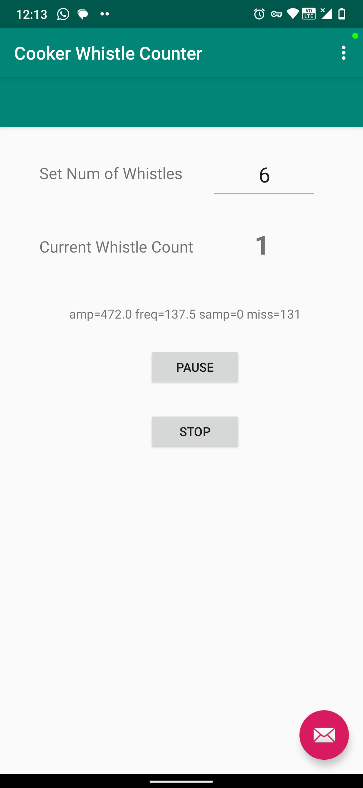

# CookerWhistleCounter
Counts pressure-cooker whistles

It is difficult to remember to the pressure cooker whistle counts. This Android app makes use of phone microphone to count the cooker whistles and rings an alarm once the desired count is reached. No more missing the real count of the cooker. 

App Screenshot             |  Cooker
:-------------------------:|:-------------------------:
  |  
